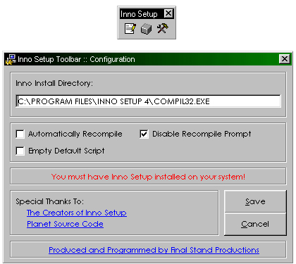



## VB6 Add\-In :: Inno Setup Toolbar

### Description

A fully-functional VB6 IDE Addin for working with the freeware installation program Inno Setup. Tested with Inno Setup Version 3 And Version 4, can autodetect the installation directory and uses the most recent installation. The controls in order are 'Script Editor', 'Compile Script' and 'Configure Toolbar'. The Script Editor will create a default script with the project name in the project folder if one does not exist, and launch the Inno Script Editor. The Compile button will automatically compile the script using Inno as long as its in the project directory. Allows you to override the path and force it to use a different Inno version, and contains options for creating blank default scripts or autogenerating a simple one. Considerably more useful than the built-in Pacakge and Deployment wizard in Visual Basic. If you find this useful, please vote - Feel free to send suggestions, also.
 
### More Info
 

             |
---                |---
**Submitted On**   |2004-08-06 10:17:16
**By**             |[Coder\_Ghost](https://github.com/Planet-Source-Code/PSCIndex/blob/master/ByAuthor/coder-ghost.md)
**Level**          |Advanced
**User Rating**    |5.0 (15 globes from 3 users)
**Compatibility**  |VB 6\.0
**Category**       |[Complete Applications](https://github.com/Planet-Source-Code/PSCIndex/blob/master/ByCategory/complete-applications__1-27.md)
**World**          |[Visual Basic](https://github.com/Planet-Source-Code/PSCIndex/blob/master/ByWorld/visual-basic.md)
**Archive File**   |[VB6\_Add\-In177882862004\.zip](https://github.com/Planet-Source-Code/coder-ghost-vb6-add-in-inno-setup-toolbar__1-55397/archive/master.zip)

